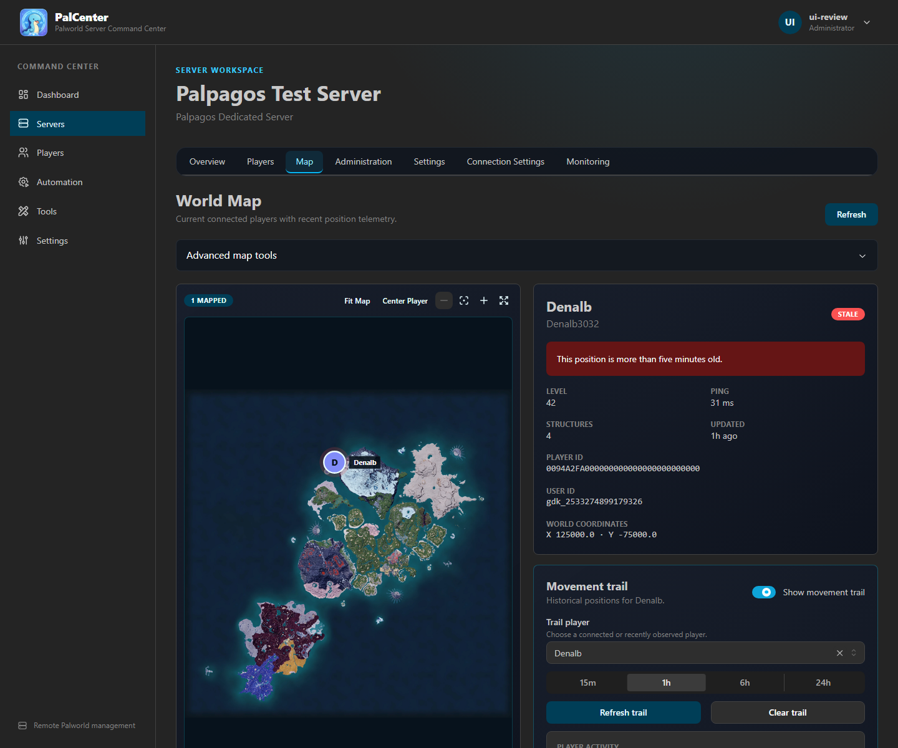

# PalCenter


**Palworld Server Command Center**

PalCenter is a self-hosted web console for administering existing Palworld
dedicated servers. It connects to each server through the official Palworld
REST API; it does not install Palworld, manage containers, or access save files.




## What PalCenter provides

- Multi-server status, health, configuration, and connection management
- Connected-player visibility with level data and kick/ban operations
- Player workspace: view and manage inventory, Pals, technology, and progression
- Player moderation: kick, ban with IP ban, and unban
- Resource grants: items, Pals, Pal templates, Pal eggs, and progression
- Guild and base camp browsing, inspection, and deletion
- Server messaging: alerts, targeted messages, and broadcasts
- World Intelligence: live Palpagos map, movement trails, and activity summaries
- Broadcast, Save World, and Graceful Shutdown operations
- Scheduled automation with immutable execution history
- Discord webhook and ntfy notifications
- Administrator, Moderator, and Visitor accounts
- Portable backup and restore
- A standalone `PalWorldSettings.ini` configuration generator

Player workspace, moderation, resource grants, guild/base management, and
enhanced messaging require PalDefender. All other features work through the
native Palworld REST API.

## Supported environments

PalCenter is distributed as a Linux container for `linux/amd64` and
`linux/arm64`. It runs with Docker Engine, Docker Desktop, Docker Compose,
Unraid Community Applications, and compatible NAS or VPS container platforms.

### Requirements

- Docker 24 or newer, or a current Unraid release
- Persistent storage for `/app/data`
- Network access from PalCenter to each Palworld REST API
- An existing Palworld dedicated server with its REST API enabled
- A modern browser

**For PalDefender features (optional):**

- PalDefender installed on the Palworld server
- PalDefender REST API accessible from the PalCenter container
- A PalDefender Bearer token

PalCenter itself does not require the Palworld host, save directory, SteamCMD,
Docker socket, or privileged container access.

## PalDefender integration

PalDefender is an optional anti-cheat and server administration plugin for
Palworld dedicated servers. It provides its own in-game commands,
administration features, and a REST API for external tools.

PalCenter integrates with PalDefender's REST API to bring supported
PalDefender administration features into the PalCenter web interface:

- View and modify player inventory, Pals, technology, and progression
- Grant items, Pals, Pal templates, and Pal eggs
- Teach or remove technology
- Grant progression levels and points
- Kick and ban players, including IP bans
- Browse guilds and base camps, inspect members, delete bases
- Send server-wide alerts and targeted player messages
- Reload PalDefender's configuration without restarting the server

PalCenter connects to PalDefender on a per-server basis. After adding a
Palworld server, open its **Connection Settings** and enter the PalDefender
REST API URL and Bearer token. The URL must be reachable from the PalCenter
container — when PalCenter runs in Docker, `127.0.0.1` refers to the
container itself, not the Palworld server.

All standard Palworld features — server status, player lists, World
Intelligence, broadcast, save, shutdown, and automation — work through the
native Palworld REST API without PalDefender.

For PalDefender installation and configuration, see the official PalDefender
project at
[github.com/Ultimeit/PalDefender](https://github.com/Ultimeit/PalDefender).

## Quick start

1. Save the repository's [`docker-compose.yml`](docker-compose.yml) and
   [`.env.example`](.env.example) in a new directory.
2. Rename `.env.example` to `.env`.
3. Start PalCenter:

   ```bash
   docker compose up -d
   ```

4. Open `http://YOUR-Docker-HOST:3000`.
5. Create the initial Administrator when prompted.
6. Select **Add Server**, enter the Palworld REST URL and administrator
   password, then test and save the connection.

The default Compose deployment uses a Docker-managed volume and runs as the
non-root `1000:1000` user.

## Installation options

### Docker Compose

The supplied [`docker-compose.yml`](docker-compose.yml) uses:

```yaml
services:
  palcenter:
    image: ghcr.io/shanebionic/palcenter:latest
    user: "${PALCENTER_UID:-1000}:${PALCENTER_GID:-1000}"
    ports:
      - "${PALCENTER_WEB_PORT:-3000}:3000"
      - "${PALCENTER_API_PORT:-3001}:3001"
    volumes:
      - palcenter-data:/app/data
```

Port `3000` serves the web application. Port `3001` is the direct API and is
not needed by browsers using the normal same-origin web interface. Restrict or
remove the host mapping for port `3001` unless an advanced integration needs
it.

See the [installation guide](docs/INSTALLATION.md) for environment variables,
bind mounts, initial startup, and Palworld REST configuration.

### Unraid

Install **PalCenter** from **Apps → Community Applications**. The official
template maps `/app/data` to `/mnt/user/appdata/palcenter` and runs as Unraid's
non-root `nobody:users` identity (`99:100`).

See the [Unraid guide](docs/UNRAID.md) for template settings, networking,
permissions, reverse proxies, backups, and upgrades.

## Production deployment

Place PalCenter on a trusted management network. For remote access, proxy the
web port through HTTPS, enable secure session cookies, and leave the direct API
private. PalCenter currently uses normal HTTP requests; no WebSocket forwarding
rule is required.

Examples for Nginx Proxy Manager, Traefik, and Caddy are in the
[reverse proxy guide](docs/REVERSE-PROXY.md).

## Authentication and access

There is no default account. The first-run wizard creates the initial
Administrator. Passwords are stored as scrypt hashes, and authenticated
sessions use signed HttpOnly cookies.

| Role          | Access                                                                |
| ------------- | --------------------------------------------------------------------- |
| Administrator | Full configuration, user, backup, notification, and automation access |
| Moderator     | Read access plus supported server and player operations               |
| Visitor       | Read-only access                                                      |

See [Security](SECURITY.md) and the [feature guide](docs/FEATURES.md).

## Major workflows

- **Player workspace:** Select a server, open **Players**, click a player, and
  view inventory, Pals, technology, and progression. Grant items, Pals, eggs,
  and progression or moderate with kick and ban. Requires PalDefender.
  [Feature guide](docs/FEATURES.md#player-workspace-paldefender)
- **Guilds and bases:** Browse guilds and base camps, inspect members, and
  delete bases. Requires PalDefender.
  [Feature guide](docs/FEATURES.md#guilds-paldefender)
- **Server messaging:** Send alerts, targeted player messages, or broadcasts
  from the Administration panel. Requires PalDefender.
  [Feature guide](docs/FEATURES.md#administration)
- **World Intelligence:** Select a server, open **Map**, choose a player, and
  enable a movement trail. The summary distinguishes selected range from
  observed telemetry. [World Map guide](docs/WORLD-MAP.md)
- **Automation:** Schedule Broadcast Message, Save World, or Graceful Shutdown.
  **Run Now** records history without changing the recurring schedule.
  [Automation guide](docs/AUTOMATION.md)
- **Backup and Restore:** Download an authenticated archive containing server
  connections, notifications, history, users, automation data, and system
  configuration. Treat archives as sensitive.
  [Backup and upgrade guide](docs/UPGRADING.md)
- **Notifications:** Configure Discord webhook or ntfy destinations and select
  server/player events. Stored Discord webhook URLs are never returned to the
  browser. [Feature guide](docs/FEATURES.md#notifications)
- **Multi-server management:** Add each remote REST connection independently;
  live state is fetched from Palworld and is not written to `servers.json`.
  [Server management guide](docs/SERVER-MANAGEMENT.md)

## Troubleshooting

Start with:

```bash
docker compose ps
docker compose logs --tail=200 palcenter
curl http://127.0.0.1:3001/api/health
```

Common causes are an unwritable `/app/data` mount, a host port conflict, an
incorrect Palworld REST URL, or container networking that cannot reach the
Palworld host. See the [troubleshooting guide](docs/TROUBLESHOOTING.md) and
[FAQ](docs/FAQ.md).

## Documentation

- [Installation](docs/INSTALLATION.md)
- [First run](docs/FIRST-RUN.md)
- [Features and permissions](docs/FEATURES.md)
- [Unraid](docs/UNRAID.md)
- [Reverse proxy](docs/REVERSE-PROXY.md)
- [Upgrading and rollback](docs/UPGRADING.md)
- [Troubleshooting](docs/TROUBLESHOOTING.md)
- [FAQ](docs/FAQ.md)
- [Server management](docs/SERVER-MANAGEMENT.md)
- [Automation](docs/AUTOMATION.md)
- [Telemetry](docs/TELEMETRY.md)
- [World Map and Player Activity Summary](docs/WORLD-MAP.md)
- [Configuration generator](docs/CONFIGURATION-GENERATOR.md)
- [Security](SECURITY.md)
- [PalCenter Wiki](https://github.com/shanebionic/palcenter/wiki)

The [PalCenter Wiki](https://github.com/shanebionic/palcenter/wiki) provides an
additional administrator-oriented copy of the deployment documentation.

## Development builds

Production:

```text
ghcr.io/shanebionic/palcenter:latest
```

Testing channel:

```text
ghcr.io/shanebionic/palcenter:dev
```

Development builds may contain unfinished work and change without notice. Use
them only for testing and create a backup before switching channels.

## Support and license

Report bugs and request features through the
[issue tracker](https://github.com/shanebionic/palcenter/issues). Report
security vulnerabilities according to [SECURITY.md](SECURITY.md).

PalCenter code and documentation are MIT licensed. Separately identified
third-party assets are excluded; the bundled Palpagos map remains copyright
Pocketpair, Inc. See [LICENSE](LICENSE) and
[THIRD_PARTY_ASSETS.md](THIRD_PARTY_ASSETS.md).

[](https://github.com/sponsors/shanebionic)
