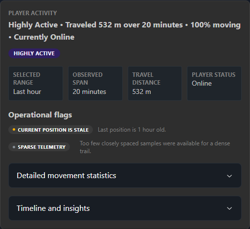

# First run

This walkthrough takes a new installation from startup to its first useful
backup and automation task.

## 1. Open PalCenter

Browse to:

```text
http://DOCKER-HOST:3000
```

If a reverse proxy is configured, use its HTTPS address instead.

## 2. Create the initial Administrator

When no users exist, PalCenter opens the setup wizard. Enter:

- username;
- email address;
- password;
- password confirmation.

The first account becomes an Administrator. There is no default username or
password, and setup cannot be repeated after the first user is created.

## 3. Add a Palworld server

From the Dashboard, select **Add Server** and enter:

- **Display Name:** the friendly name shown by PalCenter;
- **REST URL:** protocol, address, and REST port, for example
  `http://192.0.2.25:8212`;
- **Admin Password:** the Palworld server's REST administrator password.

Select **Test Connection**. Review the server name, version, player count, FPS,
and response time, then select **Save**.

The browser never receives a saved administrator password after it is stored.

## 4. Verify the Dashboard

The server card should report **Online** and show current player, FPS, version,
response-time, and health information. An offline card remains available for
management and reports the failure without preventing other servers from
loading.

Select **Manage** to open the server workspace:

- **Overview:** live status and connection information;
- **Players:** connected players and authorized player operations;
- **Map:** World Intelligence;
- **Administration:** broadcast, save, shutdown, and stop operations;
- **Settings:** read-only Palworld settings;
- **Connection Settings:** saved REST connection editing for Administrators;
- **Monitoring:** recent metrics and server events.

## 5. Verify player telemetry

Open **Players**. When players are connected, PalCenter collects their
documented REST position/state data. An empty state is normal when nobody is
online.

Telemetry collection begins automatically. Unchanged snapshots are reduced and
retained according to `PALCENTER_TELEMETRY_RETENTION_DAYS`.

## 6. Explore World Intelligence

Open **Map**:

1. Select a player marker.
2. Enable **Show movement trail**.
3. Choose 15 minutes, 1 hour, 6 hours, or 24 hours.
4. Review the Player Activity Summary.
5. Expand detailed movement statistics or timeline information only when
   needed.

The map shows observed REST telemetry, not gameplay intent. Calibration tools
are Administrator-only and collapsed under **Advanced map tools**.



## 7. Create a backup

Open **Settings → Backup & Restore** and select **Create Backup**. Store the
downloaded `.tar.gz` archive in encrypted, access-controlled storage.

The archive contains server credentials, notification credentials, users,
password hashes, history, automation tasks/executions, and application signing
configuration. Treat it as a secret.

## 8. Explore Automation

Open **Automation** and create one of the supported tasks:

- Broadcast Message;
- Save World;
- Graceful Shutdown.

Select a server, schedule, and time zone. Use **Run Now** for an immediate test.
It records execution history and does not change the task's next recurring run.

See [Automation](AUTOMATION.md) before scheduling a shutdown.

## 9. Optional administration

- Add Moderator or Visitor accounts from **User Management**.
- Configure Discord or ntfy from **Settings → Notifications**.
- Place PalCenter behind HTTPS before exposing it outside a trusted network.
- Review [Security](../SECURITY.md) and [Troubleshooting](TROUBLESHOOTING.md).
