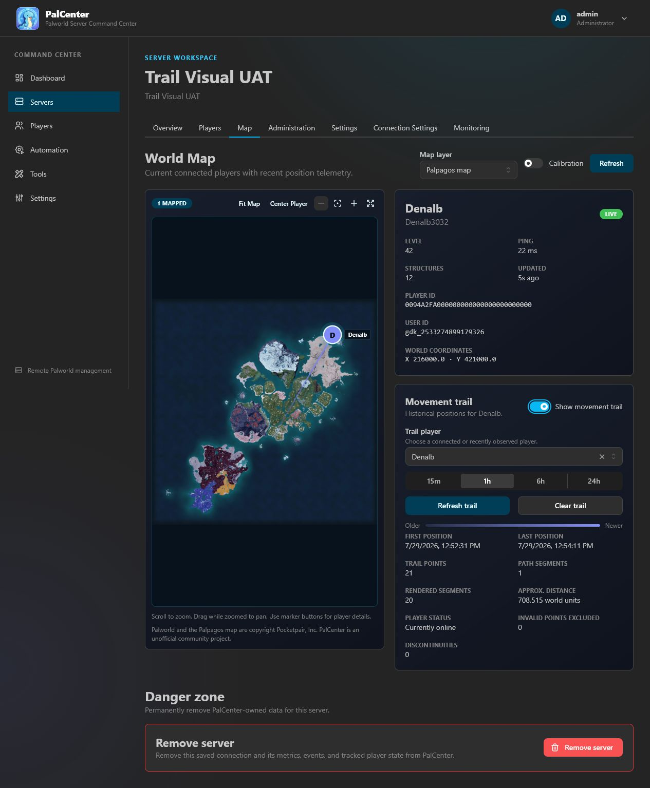

# Palpagos world map

## Living World Map

The map is the quickest way to see what is happening on a server. The large
Palpagos view shows connected players, while the right side lists everyone who
is online, selected-player details, and recent joins or departures.

- Select a player to open their details.
- Use **Follow Player** to keep the selected player centered while they move.
- Switch between **Palpagos** and **World Tree** manually. Each map plots
  only players from its own coordinate space: a player located in the World
  Tree is listed under **Players on other maps** on the Palpagos view (and
  vice versa). **View on Palpagos**, **View on World Tree**, **Follow Player**,
  and **Center Player** intentionally switch to that player's map. Players
  PalCenter cannot locate are listed under **Location unavailable**.
- Players with unknown, legacy, special-area, or instance coordinate spaces
  keep the documented bounds-based behavior on the active map instead of
  being treated as authoritative map locations.

PalCenter obtains player positions from the official Palworld REST API, or
from PalDefender when PalDefender is configured for the server. Neither
source identifies special-stage instances, so positions in those areas are
shown as approximate rather than presented as authoritative map locations.

PalCenter includes an interactive Palpagos reference map for current connected
players. When PalDefender is configured, base camp markers appear on the same
map and can be toggled with the **Layers** menu alongside the Players and
Trails layers. The position pipeline, controls, and freshness indicators
remain independent from the bundled image layer.

## Asset and licensing decision

The repository bundles 2048×2048 and 4096×4096 WebP derivatives of the
8192×8192 Palpagos world map texture (T_WorldMap) extracted from the owner's
installed Palworld Xbox build (version 1.10.1283.0). The extraction also
yielded DT_WorldMapUIData, which supplies the game's authoritative terrain/map
bounds.

The image remains copyright Pocketpair, Inc. It is not covered by PalCenter's
MIT license. PalCenter is unofficial, unaffiliated, free, open source, and
noncommercial, and includes the map only as a functional reference layer for
official REST API player-location data. The full source record, checksum,
attribution, and removal policy are in the asset's
[`ASSET-NOTICE.md`](../apps/frontend/public/world-maps/palpagos/ASSET-NOTICE.md),
[`source.json`](../apps/frontend/public/world-maps/palpagos/source.json), and
the repository-level [`THIRD_PARTY_ASSETS.md`](../THIRD_PARTY_ASSETS.md).

The World Tree map receives the same treatment: 2048×2048 and 4096×4096 WebP
derivatives of the 8192×8192 T_TreeMap texture extracted from the same
installed build, with authoritative bounds from the DT_WorldMapUIData "Tree"
row. Its projection status is owner-validated: live World Tree player UAT
confirmed marker placement on 2026-08-15. See the asset's
[`ASSET-NOTICE.md`](../apps/frontend/public/world-maps/world-tree/ASSET-NOTICE.md)
and
[`source.json`](../apps/frontend/public/world-maps/world-tree/source.json).

The upstream 8192×8192 binary is not shipped in the production frontend.
Ordinary clients default to the 2048×2048 derivative; browsers can select the
4096×4096 derivative for a sufficiently large or high-density rendered map.
Both derivatives use WebP quality 90, effort 6, and Lanczos3 resizing with
`fit: fill`. Because the source and output are all square, this performs a
direct full-frame scale with no crop, rotation, padding, or boundary change.

| Bundled derivative    | Compressed size | Approximate RGBA decode |
| --------------------- | --------------: | ----------------------: |
| `world-map-2048.webp` |   412,816 bytes |                  16 MiB |
| `world-map-4096.webp` | 1,410,000 bytes |                  64 MiB |

The original file was 27,458,010 bytes and could require approximately 256 MiB
when decoded as RGBA. The default derivative reduces transfer size by 98.5% and
decoded pixel memory by approximately 93.8%; the larger derivative reduces
transfer size by 94.8% and decoded pixel memory by approximately 75%.

The derivatives are bundled in the application and are never hotlinked at
runtime. The map image layer is the only bundled image layer.

## Coordinate sources

The map projection uses these sources:

- the [official Palworld REST API `/players` documentation](https://docs.palworldgame.com/0.2.4.0/api/rest-api/players/)
  for the documented `location_x` and `location_y` fields;
- the [official Unreal Engine coordinate-system documentation](https://dev.epicgames.com/documentation/en-us/unreal-engine/coordinate-system-and-spaces-in-unreal-engine)
  for Unreal's left-handed, Z-up world-coordinate convention;
- the authoritative `DT_WorldMapUIData` bounds extracted from the owner's
  installed Palworld Xbox build (version 1.10.1283.0).

Owner geographic validation confirmed that REST API WorldLocation coordinates
are directly in the DT_WorldMapUIData terrain coordinate space — no translation
is required. The projection uses DT bounds directly.

## Standard and exact locations

PalCenter can show player locations and movement trails using the standard
Palworld REST API. Valid REST coordinates use the Palpagos projection even when
older or unverified telemetry does not identify a map area. Stale positions
remain visible with a clear age label and are never described as live.

The standard API cannot reliably identify dungeons, boss towers, the World
Tree, or other secondary areas. Players in those areas may therefore appear in
the wrong place on Palpagos. PalCenter keeps them visible rather than making the
normal map unusable.

Existing coordinate-space fields, map definitions, last trusted Palpagos
positions, and trail segmentation remain in place for stored-data
compatibility. No historical rows are destructively rewritten. Rows stored
with the default `unknown` coordinate space remain usable at display time.

## Projection

The configured raw world bounds are from DT_WorldMapUIData:

| Axis |    Minimum | Maximum |      Span |
| ---- | ---------: | ------: | --------: |
| X    | -1,099,400 | 349,400 | 1,448,800 |
| Y    |   -724,400 | 724,400 | 1,448,800 |

PalCenter first normalizes both axes:

```text
rawX = (worldX - worldMinX) / (worldMaxX - worldMinX)
rawY = (worldY - worldMinY) / (worldMaxY - worldMinY)
```

It then applies a 90-degree clockwise rotation around the map center. For the
current constants, the resulting browser position is:

```text
mapX = rawY
mapY = 1 - rawX
```

`mapX` and `mapY` are unit coordinates from 0 through 1 and are rendered as
percentages. Invalid, non-finite, or out-of-bounds coordinates are never
clamped into a misleading marker. They are listed in the sidebar with the
**Location unavailable** state instead of being plotted.

All bounds, axis inversion, and rotation options live in one projection
configuration in `apps/frontend/lib/world-map/projection.ts`. The forward and
inverse transforms are pure functions with regression tests for bounds,
negative values, orientation, invalid data, and round trips.

## Player identity and freshness

Only players in the current live roster are eligible for a marker — the
official `/players` response, or the PalDefender roster when PalDefender is
configured for the server. PalCenter joins that response to the latest stored
position using `userId`, the stable telemetry/history key. A stored record for
a disconnected player is not rendered.

Because unchanged telemetry is intentionally stored only on the five-minute
heartbeat, the latest database row alone is not a reliable indication that the
collector is healthy. The existing telemetry response includes the last
successful collection time in memory and the configured polling interval. The
map uses the later of that successful verification time and the stored
snapshot time:

- **Live:** no more than two polling intervals old;
- **Delayed:** older than two polling intervals but no more than five minutes;
- **Stale:** older than five minutes.

This health timestamp is not persisted and does not change telemetry retention,
write reduction, backup contents, or restore behavior. After PalCenter starts,
the map falls back to the stored snapshot time until the first successful
collection.

## Access and privacy

Map access matches the existing Players tab:

- Administrators and Moderators can view the map.
- Visitors cannot view the map.

The marker detail panel shows the player's display and account names, Palworld
identifiers, level, ping, structure count, X/Y coordinates, age, and freshness.
It does not display, copy, or log player IP addresses.

The map supports mouse and touch/pointer panning, pointer-centered wheel zoom,
Fit Map, Center Player, Reset View, and an expanded full-viewport mode. Wheel
input is captured only while the pointer is over the map. Pan limits keep part
of the map recoverable, and Fit Map restores the complete square coordinate
plane after navigation. Marker buttons are keyboard focusable, have one
accessible name, and retain a visible focus indicator. Player labels preserve
the capitalization returned by Palworld and truncate safely when space is
limited. Marker icons and labels retain their Fit Map screen-space size while
their geographic anchors continue to follow map zoom and pan.

## Historical movement trails

Administrators and Moderators can select a connected player and enable
**Show movement trail**. Available ranges are 15 minutes, 1 hour, 6 hours, and
24 hours. Changing the range refreshes the trail; **Refresh trail** requests it
again, and **Clear trail** removes it without changing stored telemetry.



Trails use the existing stable `userId` telemetry key and Palpagos projection.
Each player receives a consistent marker and trail color derived from that
identifier. Faint trail sections are older, while brighter sections are newer;
the **Older — Newer** legend provides the same cue in text. The newest-point
indicator uses the player color, while the subdued start indicator remains
visually distinct from the live marker.

The visual age range is calculated only from the oldest and newest movement
timestamps actually returned for the selected player and range. A partially
populated 24-hour request therefore still uses the complete Older — Newer
visual range; preset duration, retention length, and current wall-clock time do
not dilute the fade.

The API returns only capture time and raw X/Y coordinates—never player IPs,
account details, server connection details, or credentials. Visitors cannot
access trail history.

Requests are limited to 24 hours and the newest 5,000 captured points. Raw data
remains governed by `PALCENTER_TELEMETRY_RETENTION_DAYS` (30 days by default),
so a range may be empty when the player was absent or data has expired. This
feature adds no polling or persistence.

PalCenter sorts points chronologically, rejects invalid or out-of-bounds
coordinates, removes consecutive duplicates, and reduces dense paths while
preserving endpoints. It splits paths when captures are separated by more than
the greater of three polling intervals or two minutes, when movement exceeds
200,000 world units and is classified as a likely teleport, or when invalid
data interrupts history. Disconnected periods are never joined by a misleading
line.

Movement is drawn in chronological sections with a subtle, screen-stable line
width of approximately 1.2–1.5 pixels. Older movement retains at least 35%
opacity and 85% brightness so short trails remain readable. Rendering is capped
at 400 connected lines even when the selected history contains more stored
positions, keeping zoom and pan responsive while preserving the endpoints of
each represented continuous path. Start and end states are distinct and have
text descriptions. The summary reports the time span, points, path and rendered
section counts, invalid exclusions, discontinuities, online state, and
approximate distance in Palworld world units. Distance excludes gaps and likely
teleports and is an operational estimate.

## Player Activity Summary

When a player and movement trail are selected, PalCenter converts the returned
telemetry into a compact administrator-facing summary. The trail remains the
source visualization; the summary explains the observed movement without
requiring an administrator to interpret every line on the map. It disappears
when the trail is cleared or no valid history is available.

The **Executive Summary** is the first sentence and combines the deterministic
classification, travel distance, observed duration, movement percentage, and
current connection state. It does not use AI and does not infer gameplay
intent.

The normal summary keeps the classification, operational flags, selected
range, observed span, travel distance, and current status immediately visible.
Detailed movement statistics plus the event timeline and insights are available
in expandable sections. This keeps routine review concise without removing
diagnostic context.

### Activity classifications

Classifications use these fixed thresholds:

- **Offline:** the player is not connected and the newest returned position is
  more than five minutes old.
- **Recently Disconnected:** the player is not connected and the newest
  returned position is no more than five minutes old.
- **Idle:** connected, with no more than 5% of valid observed time moving.
- **Mostly Idle:** connected, with more than 5% and no more than 25% moving.
- **Exploring:** connected, with more than 25% and no more than 75% moving.
- **Highly Active:** connected, with more than 75% moving.

Movement means an adjacent valid sample changed by more than 100 Palworld world
units. These names describe telemetry patterns only.

### Operational flags

Flags identify threshold crossings that may help an administrator investigate:

- a stationary period lasting at least ten minutes;
- a movement jump above 200,000 world units, excluded as a likely teleport;
- two or more telemetry disconnects;
- observed movement at or above 1,000 world units per second;
- a newest position at least five minutes old;
- fewer than three samples or average valid sample spacing above three polling
  intervals.

If none apply, the panel explicitly reports **No notable events**. A telemetry
gap must exceed ten minutes (or six polling intervals when that is longer) to
count as a disconnect. This accommodates the collector's five-minute unchanged
position heartbeat without treating an idle player as disconnected.

### Movement calculations

The **Selected range** is the administrator's requested 15-minute, 1-hour,
6-hour, or 24-hour preset. The **Observed span** is the elapsed time between
the oldest and newest valid returned samples, so a 24-hour selection containing
only 20 minutes of telemetry reports **Last 24 hours** and **20 minutes**
separately. The selected range is display context only and does not affect
movement calculations, classification, or trail fading.

The statistics also show first and last activity, valid active duration, moving
and stationary durations, sample and rendered-line counts, approximate
distance, average and peak speed, longest stationary period, separate
disconnect and excluded-teleport counts, online state, position age, and
moving/stationary percentages. Active duration is the sum of valid adjacent
sample intervals. Moving and stationary durations divide that active duration
according to the movement threshold.

Invalid coordinates, likely teleports, and disconnected gaps contribute no
distance, speed, active duration, or moving/stationary time. Displayed metric
units use 100 Palworld world units per meter. Average movement speed is moving
distance divided by moving time only; positional drift in stationary intervals
does not inflate it. Approximate travel distance retains the complete valid
path distance. Maximum speed is the highest valid adjacent moving-sample speed.
Stationary accumulation and movement-transition state reset at every
disconnect or excluded teleport, so separate continuous paths cannot combine
into a false long-stationary period. Moving and stationary durations exclude
invalid samples, teleports, and disconnected gaps.

### Timeline and insights

The timeline lists meaningful transitions—first observation, movement starting
or resuming, long stationary periods, telemetry disconnects/resumptions, and
the last online observation. It does not list every sample. Insights contain at
most two concise statements derived from movement percentage and disconnected
session count. They remain factual and do not speculate about player intent.

## Projection validation

The interactive calibration panel, calibration grid, and diagnostics controls
were removed in 1.5.1. The projection is fixed to the validated
DT_WorldMapUIData bounds in `apps/frontend/lib/world-map/projection.ts`, and
the forward and inverse transforms are covered by regression tests.

Live UAT confirmed that the DT_WorldMapUIData projection correctly aligns
known base locations against the first-party T_WorldMap asset. Owner geographic
validation verified that WorldLocation coordinates are directly in the
DT_WorldMapUIData terrain coordinate space.

The validation landmark at world position `X -211552.453125, Y 262807.65625`
projects to `68.14%, 38.72%` under the DT bounds, matching its expected
position on the first-party T_WorldMap.

## Administrator navigation checks

Before release, verify in Chromium:

- at 1920×1080 and laptop widths, the normal viewport is at least 500px tall;
- opening Map shows the complete map in Fit Map state;
- zoom and pan transform only the internal square plane without changing the
  viewport dimensions or moving surrounding page content;
- panned content remains clipped by the viewport;
- wheel input over the map zooms without scrolling the page;
- the page still scrolls normally outside the map;
- Center Player reveals and briefly highlights the selected marker;
- expanded mode uses most of the browser height and retains the selected marker,
  layer, controls, and independently scrollable details;
- Escape closes expanded mode and restores the original normal dimensions;
- Fit Map recovers from extreme zoom and pan;
- the untransformed surface, image, and marker plane remain square;
- the known `68.14%, 38.72%` validation landmark appears in the expected area;
- the laptop, 1920×1080, and narrow/mobile layouts have no horizontal page
  overflow;
- player and base detail panels contain no server address, token, credential,
  password, or player IP.

## Current limitations

The current release does not add or claim:

- World Tree base camp markers (base DTOs carry no coordinate-space field);
- multiple islands or world/map variants with separate bounds;
- heatmaps, analytics, or historical playback;
- `/game-data` collection, Z-axis display for native-source players, guild
  membership data, PalBoxes, or world actors. Interactive base camp markers
  are shown when PalDefender is configured, using a separate PalDefender
  request rather than the telemetry collector.

The coordinate source is the native `/players` telemetry, or the PalDefender
provider when PalDefender is configured for the server. If a future game build
changes its coordinate space or map bounds, the centralized projection
configuration and its regression tests must be updated together.
