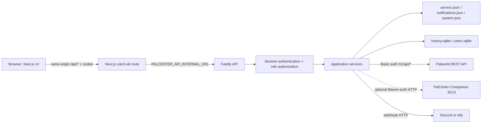
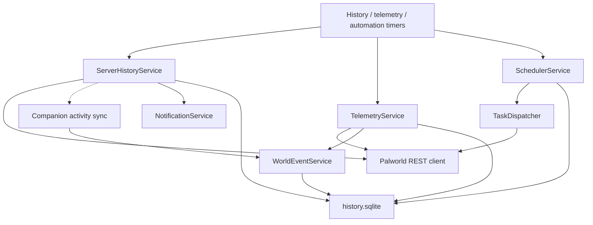

# Repository architecture overview

## 1. Executive summary

This document describes the `dev` branch at issue #77. PalCenter is a pnpm/Turborepo monorepo containing a Next.js browser application and a Fastify API, plus shared lint, TypeScript, and currently-unused UI packages. The production image runs the web and API processes together but they remain separate HTTP services.

The browser talks to same-origin Next.js `/api/*` routes. Next.js forwards those requests, including the session cookie, to Fastify. Fastify owns authentication, authorization, persistence, scheduling, telemetry, notifications, backup/restore, and all outbound connections. Each configured Palworld server is reached directly through its official Basic-auth REST API. The optional Companion is a second HTTP integration derived from the server connection; it augments locations and activity and enables teleport actions, but normal REST management continues without it.

The main obstacle to adding `apps/agent` and provider abstractions is not the monorepo layout. It is that `apps/api/src/index.ts` is both composition root and route registry, while services instantiate `PalworldRestClient` directly and Companion behavior crosses connection storage, telemetry, events, API routes, and UI. Required migration work should first introduce explicit server-provider contracts and centralize provider selection. Splitting routes or adopting a client cache is useful cleanup, not a prerequisite.

## 2. Repository tree

```text
palcenter/
├── apps/
│   ├── api/                 Fastify API, services, repositories, tests
│   │   ├── src/clients/     Official Palworld REST client
│   │   ├── src/providers/   Notification provider contracts/adapters
│   │   ├── src/repositories JSON and SQLite persistence
│   │   ├── src/services/    Application/domain services and schedulers
│   │   ├── src/telemetry/   Player telemetry collection and persistence
│   │   └── test/            Node test-runner integration/unit tests
│   └── frontend/            Next.js App Router application
│       ├── app/             Routes and same-origin API proxy
│       ├── components/      Feature and local UI components
│       ├── lib/             API client and pure feature utilities
│       ├── types/           Browser-facing data contracts
│       ├── test/            Node test-runner unit tests
│       ├── e2e/             Playwright UI and production-CSS tests
│       └── public/          Branding and map assets
├── packages/
│   ├── eslint-config/       Shared ESLint presets
│   ├── typescript-config/   Shared TypeScript presets
│   └── ui/                  Starter React primitives; not imported by apps
├── docs/                    Operator, feature, and architecture documentation
├── scripts/                 Production two-process launcher
├── Dockerfile               Multi-stage combined production image
├── docker-compose.yml       Single-service deployment with persistent volume
├── pnpm-workspace.yaml      apps/* and packages/* workspace membership
└── turbo.json               Workspace build/check task graph
```

Generated `.next`, `dist`, dependency, and runtime data directories are not source-owned and are omitted.

## 3. Application and package inventory

| Unit                          | Responsibility                                           | Boundary/ownership                                                                                                            |
| ----------------------------- | -------------------------------------------------------- | ----------------------------------------------------------------------------------------------------------------------------- |
| `apps/frontend` (`web`)       | Next.js 16/React 19 UI, route protection, API forwarding | Presentation and browser interaction only; does not contact Palworld or Companion directly                                    |
| `apps/api` (`@palcenter/api`) | Fastify API and all server-side behavior                 | Owns credentials, sessions, authorization, persistence, remote integrations, polling, automations, notifications, and backups |
| `packages/eslint-config`      | Base, React, and Next lint presets                       | Build-time shared configuration                                                                                               |
| `packages/typescript-config`  | Base, Next, React-library compiler presets               | Build-time shared configuration                                                                                               |
| `packages/ui` (`@repo/ui`)    | Generic `Button`, `Card`, and `Code` starter components  | Present in the workspace but not consumed by either application; PalCenter's effective design system lives in `apps/frontend` |

There is no shared domain/contracts package. API and frontend independently define overlapping connection, Companion, automation, notification, user, telemetry, and event shapes. This is an important ownership ambiguity for provider work.

## 4. Runtime and data flow

### Interactive request flow



### Background flow



The production launcher starts Fastify on port 3001 and the standalone Next.js server on port 3000. It injects `PALCENTER_API_INTERNAL_URL=http://127.0.0.1:<api port>` into the frontend process. Development uses Turborepo to run both applications.

## 5. Frontend architecture

- **Framework and routing:** Next.js 16 App Router with routes for dashboard (`/`), servers, a tabbed server workspace (`/servers/[id]`), players, automation, settings, notifications, backup, users, profile, login/setup, and tools/config generator. `proxy.ts` protects page routes, redirects first-run and unauthenticated users, enforces forced password changes, and hides administrator-only pages.
- **API boundary:** `lib/api.ts` is the single typed fetch facade. It uses `NEXT_PUBLIC_API_URL` when supplied and otherwise same-origin `/api`. `app/api/[...path]/route.ts` forwards GET/POST/PUT/PATCH/DELETE, query strings, cookies, content type, downloads, and the restore-confirmation header to Fastify.
- **State and fetching:** there is no global state store or query library. Client components use local React state/effects, explicit loading/error state, and feature-specific refresh intervals (for example automation at 15 seconds and monitoring at 30 seconds). Mutations call the API facade and manually reload local state.
- **Components:** route files are generally thin and delegate to feature components. `ServerWorkspace` composes overview, administration, monitoring, players, settings, connection settings, world events, map, and danger-zone features. Pure transformation logic is kept under `lib`, notably world-map projection/layers/trails, teleport capability checks, automation helpers, and configuration generation.
- **Design system:** Mantine is the actual base, configured in `theme.ts`, with global tokens/classes in `app/globals.css` and local primitives under `components/ui` (`SectionCard`, `SectionHeader`, `StatCard`, `DangerCard`). `ApplicationShell`, `PageHeader`, `EmptyState`, and `BrandedLoader` form the application-level patterns. The workspace `@repo/ui` package is generic scaffold code and is unused.
- **Contract risk:** frontend types duplicate API types rather than importing a shared contract. The API facade performs runtime error handling but response success bodies are compile-time casts rather than runtime-validated contracts.

### API consumption by frontend feature

| Frontend feature            | PalCenter API endpoints consumed                                                                                                                       |
| --------------------------- | ------------------------------------------------------------------------------------------------------------------------------------------------------ |
| Login/setup/session/shell   | `GET /api/auth/setup-status`, `POST /api/auth/setup`, `POST /api/auth/login`, `GET /api/auth/session`, `POST /api/auth/logout`                         |
| Dashboard and server lists  | `GET /api/servers`, `GET /api/servers/status`                                                                                                          |
| Server workspace/connection | `GET /api/servers/:id`, `POST /api/servers/test`, `POST /api/servers`, `POST /api/servers/:id/test`, `PUT /api/servers/:id`, `DELETE /api/servers/:id` |
| Administration              | `POST /api/servers/:id/admin/announce`, `/save`, `/shutdown`, `/stop`                                                                                  |
| Players                     | `GET /api/servers/:id/players`; player `kick`, `ban`, and `unban` POST routes                                                                          |
| Settings/monitoring         | `GET /api/servers/:id/settings`, `/history`, `/events`                                                                                                 |
| Companion and teleport      | `GET /api/servers/:id/companion`, `POST .../companion/refresh`, and three `.../teleport/*` POST routes                                                 |
| World map/intelligence      | players, latest telemetry, player telemetry history, world events, and Companion status                                                                |
| Automations                 | summary, preview, list/create/update/delete, enabled toggle, manual run, and execution history routes under `/api/automations`                         |
| Notifications               | list/create/update/delete/test under `/api/notifications`                                                                                              |
| Backup                      | `GET /api/backup/info`, `POST /api/backup`, `POST /api/backup/restore`                                                                                 |
| Profile/users               | current-user/password routes and administrator user CRUD/password-reset routes                                                                         |

`GET /api/health` is used by the container health check rather than a UI feature.

## 6. Backend architecture

- **Framework/composition:** Fastify 5 with Zod request/environment validation. `src/index.ts` constructs every repository and service, starts background workers, registers hooks and every route, and maps domain/integration errors to HTTP responses. There is no plugin/module route decomposition or dependency-injection container.
- **Authentication:** first-run setup creates the initial administrator. Passwords use the `PasswordService`; sessions are signed, expiring, HttpOnly, SameSite=Strict cookies. Signing material is generated and stored in `system.json` or initially migrated from `PALCENTER_SESSION_SECRET`. Login attempts are rate-limited in process memory by remote address.
- **Authorization:** roles are `administrator`, `moderator`, and `visitor`. Permissions cover read, operate, and management of servers, notifications, backups, automations, and users. A global request hook maps method/path to permissions. The frontend redirects improve UX but Fastify is authoritative.
- **Service boundaries:** connection, status, settings, player, administration, removal, history, telemetry, world-event, automation/scheduling, notification, backup, user, authentication, and Companion discovery behaviors are separate classes. Task executors adapt automation tasks to administration operations; notification providers already demonstrate a small provider interface.
- **Dependencies:** services receive repository/service dependencies through constructors, but Palworld-facing services create `PalworldRestClient` directly per operation. The composition root uses concrete JSON/SQLite repositories. Companion discovery receives the connection repository and performs fetches itself.
- **Persistence:** `servers.json` stores server URLs, administrator passwords, Companion settings/token, and administrator player selection; `notifications.json` stores notification destinations/credentials; `system.json` stores installation ID and session secret. `history.sqlite` is shared by metrics/events, telemetry, world events/activity state, and automations/executions. `users.sqlite` stores users and password hashes. Files are placed under `CONFIG_DIR`, initialized with restrictive permissions where supported, and included in authenticated backup/restore (except backup metadata, which is archive-only).

### PalCenter API surface

The current Fastify surface is grouped as follows:

- Public/session: health; setup status/setup; login/session/logout.
- Users: current profile/password and administrator list/create/update/delete/reset-password.
- Servers: list/status/detail, connection test/create/update/delete, REST administration, players and moderation, settings, history/events.
- Companion: discovery/refresh, admin-to-player, player-to-admin, and player-to-location teleport.
- Intelligence: world events, latest player telemetry, and bounded player telemetry history.
- Automations: summary, schedule preview, list/filter, CRUD, enabled state, manual run, and run history.
- Notifications: list, CRUD, and delivery test.
- Backup: information, archive download, and confirmed restore.

### Official Palworld REST integrations

`PalworldRestClient` targets `<baseUrl>/v1/api`, uses Basic authentication as `admin:<adminPassword>`, and applies an eight-second timeout. Current calls are:

| Method/path                    | PalCenter use                                          |
| ------------------------------ | ------------------------------------------------------ |
| `GET /info`                    | identity/version and connection test                   |
| `GET /metrics`                 | connection test, status, and history                   |
| `GET /settings`                | read-only server configuration and password status     |
| `GET /players`                 | player list, telemetry, status, and activity inference |
| `POST /announce`               | manual and scheduled broadcasts                        |
| `POST /save`                   | manual and scheduled world save                        |
| `POST /shutdown`               | manual and scheduled shutdown                          |
| `POST /stop`                   | immediate stop                                         |
| `POST /kick`, `/ban`, `/unban` | player moderation                                      |

No application code accesses Palworld save files, SteamCMD, containers, or Docker sockets.

## 7. Companion coupling map

The Companion is not a workspace package or process in this repository. It is an independently deployed optional service alongside Palworld. PalCenter derives its host from the Palworld REST URL unless overridden, defaults to port 8213, and optionally sends a bearer token. Discovery is cached for 30 seconds; capabilities control exact locations, activity, and teleport actions. Private networking or a TLS proxy is required because the token does not encrypt traffic.

| Coupling point           | Current dependency                                                                                                                                  |
| ------------------------ | --------------------------------------------------------------------------------------------------------------------------------------------------- |
| Connection model/storage | `companionEnabled`, host, port, API token, and administrator player ID in connection types, JSON schema, public redaction, create/update validation |
| API composition/routes   | `CompanionDiscoveryService`, discovery/refresh routes, three teleport routes                                                                        |
| Telemetry                | latest telemetry overlays Companion coordinates and marks coordinate-space authority                                                                |
| World events             | background sync imports exact Companion player activity and de-duplicates REST inference                                                            |
| Server status            | exposes masked Companion configuration summary                                                                                                      |
| Frontend contracts/API   | Companion status/capability types and discovery/refresh/teleport calls                                                                              |
| Connection UI            | enable/host/port/token/admin-character fields and `CompanionStatusCard`                                                                             |
| Players/map/events UI    | teleport controls, exact location/coordinate-space behavior, activity source/status notices                                                         |
| Tests/docs/assets        | API tests, frontend unit/E2E fixtures, screenshots, and `docs/COMPANION.md`                                                                         |

**Safest hiding boundary:** add one server-issued capability/feature value (for example `features.companion=false`) to a session/bootstrap or server response and gate Companion navigation/sections/actions at `ServerWorkspace` and its child feature entry points. The API must remain authoritative: return not-found or feature-disabled for Companion and teleport routes when disabled, and skip Companion calls in telemetry/world-event composition. This hides the feature without deleting stored fields, breaking backups, or spreading build-time environment checks through components. A single frontend-only flag would leave endpoints and background calls active; merely setting each connection's `companionEnabled` would mutate user data and would not hide the UI.

There is no general feature-flag mechanism today. `enabled` fields exist for accounts, notifications, automations, and per-server Companion discovery, but these are domain state rather than release flags.

## 8. Configuration and deployment model

### Configuration and secrets

Fastify validates environment variables at startup: `NODE_ENV`, `PORT`, `CONFIG_DIR`, history/telemetry/automation intervals, build metadata, session duration/cookie security, CORS origins, trusted proxy, log level, and maximum backup size. The Docker launcher uses `API_PORT` and `WEB_PORT`; it translates `API_PORT` to the API's `PORT`. Next.js uses server-only `PALCENTER_API_INTERNAL_URL` for forwarding and optionally exposes `NEXT_PUBLIC_API_URL` to browser code.

Server admin passwords, Companion tokens, notification webhook URLs/tokens, password hashes, and the session secret persist in the data directory. Public connection/notification representations mask or omit secret values; blank credential edits preserve existing values. Fastify logger redaction covers authorization/cookies and known secret request fields. Backups contain credentials and are therefore sensitive. There is no external secret manager or at-rest encryption; filesystem permissions and volume access are the trust boundary.

### Docker and Unraid

The multi-stage Dockerfile installs the pnpm workspace, builds TypeScript API output and Next.js standalone output, installs production API dependencies, and produces one unprivileged Node 22 image. The runtime drops to `node`, owns `/app/data`, declares it as a volume, exposes 3000/3001, starts both processes, and health-checks Fastify. Compose runs one service, supports UID/GID mapping, drops all Linux capabilities, enables `no-new-privileges`, publishes both ports, and mounts a named data volume.

Unraid uses the same image and data/network model. PalCenter requires outbound network reachability to each Palworld REST endpoint (and optional Companion endpoint). It deliberately needs no Palworld directories or Docker socket. Reverse-proxy deployments should expose the web service, use secure cookies with HTTPS, configure trusted proxy/CORS deliberately, and generally keep the API and Companion off the public Internet.

## 9. Build and test command matrix

Commands below are copied from the root/application package files and contributor guide.

| Scope                  | Command                                                             | What it verifies                                               |
| ---------------------- | ------------------------------------------------------------------- | -------------------------------------------------------------- |
| Workspace setup        | `pnpm install --frozen-lockfile`                                    | Lockfile-consistent dependencies                               |
| Development            | `pnpm dev`                                                          | Persistent Turbo dev tasks; frontend 3000, API 3001            |
| Build                  | `pnpm build`                                                        | API TypeScript output and Next.js production build             |
| Types                  | `pnpm check-types`                                                  | Turbo type checks (`tsc --noEmit`; Next type generation first) |
| Lint                   | `pnpm lint`                                                         | Frontend and shared-package ESLint; API defines no lint task   |
| Format                 | `pnpm format` / `pnpm format:check`                                 | Prettier rewrite/check for repository files                    |
| Unit/integration tests | `pnpm test`                                                         | API and frontend Node test-runner suites                       |
| API only               | `pnpm --filter @palcenter/api dev\|build\|start\|check-types\|test` | API lifecycle and checks                                       |
| Frontend only          | `pnpm --filter web dev\|build\|start\|lint\|check-types\|test`      | Web lifecycle and checks                                       |
| UI E2E                 | `pnpm --filter web test:ui`                                         | Playwright UI suite with its UI configuration                  |
| Production CSS         | `pnpm --filter web test:production-css`                             | CSS asset assertion plus Playwright production-CSS suite       |
| Dependency audit       | `pnpm audit --prod`                                                 | Production dependency vulnerabilities                          |
| Container              | `docker build .`                                                    | Production image build                                         |

For this documentation-only change, `pnpm format:check`, `pnpm lint`, and `pnpm check-types` are proportionate; full tests/build remain the repository's pre-PR baseline and should be used when code or deployment behavior changes.

## 10. Risks and recommended refactors

### Required migration work

1. Define provider-neutral contracts for server identity/status/settings, players, administration, and capabilities before adding PalDefender. The contract must express unsupported operations and data provenance rather than assume every provider mirrors Palworld REST.
2. Move direct `new PalworldRestClient(...)` construction behind a provider registry/factory injected into services. Preserve connection lookup and secret ownership in the API.
3. Add an explicit provider discriminator and versioned migration to stored server connections. Treat existing records as the official REST provider so upgrades are backward-compatible.
4. Decide the Agent trust/authentication and transport model before persisting Agent endpoints or secrets. Separate Agent connectivity from a game-server provider: an Agent may host/proxy multiple provider implementations.
5. Centralize feature/capability exposure so the API, background collectors, and frontend agree on whether Companion/provider operations are available.
6. Establish shared or generated API contracts for the new provider surface to prevent the current frontend/backend type duplication from multiplying.

### Optional cleanup

- Split `index.ts` into route plugins and a composition module; this improves navigation and isolated testing but is not necessary to define contracts.
- Consolidate the four owners of `history.sqlite` behind a database lifecycle/migration unit to reduce schema and backup coordination risk.
- Introduce a request/query layer in the frontend to deduplicate polling, cancellation, loading, and cache behavior.
- Either adopt `packages/ui` as the real design-system boundary or remove/rename the unused scaffold to avoid false ownership signals.
- Add runtime response validation or generated clients at the browser boundary.
- Replace in-memory login rate limiting if multi-instance API deployment becomes a requirement.

Other migration risks include sensitive legacy connection records, backup compatibility, capability-version skew, mixed REST/Companion data authority, scheduled operations during provider outages, and current assumptions that one URL/password pair identifies one server.

## 11. Proposed insertion points for Agent and provider layers

```text
apps/agent/                         new independently deployable lightweight agent
packages/provider-contracts/       transport-neutral capabilities and DTOs
apps/api/src/providers/servers/    ServerProvider interface and registry
  palworld-rest-provider.ts        wraps the current PalworldRestClient
  paldefender-provider.ts          future implementation
  agent-provider.ts                future remote transport adapter, if required
apps/api/src/services/             consume provider registry, not concrete clients
```

The first PR should introduce contracts plus an official-REST adapter with characterization tests and no behavior change. The composition root should select a provider from the migrated connection record and inject it into status, settings, player, administration, history, and telemetry services. Companion should initially remain a capability adjunct behind its own boundary; only merge it into a broader provider contract after Agent/PalDefender capability semantics are known. The frontend should render server-reported capabilities instead of branching on provider names.

Recommended next PR: add provider contracts, an adapter around the existing `PalworldRestClient`, a registry/factory, and compatibility tests while preserving the current connection schema externally and current request behavior.

## 12. Open questions

The repository cannot resolve the following product/protocol decisions:

- Will `apps/agent` run on every Palworld host, centrally, or in either topology, and can one Agent manage multiple servers?
- What transport, enrollment, identity, certificate/token rotation, and authorization model will secure PalCenter-to-Agent communication?
- Is PalDefender reached directly by PalCenter, only through the Agent, or both?
- Which provider is authoritative when official REST, PalDefender, and Companion expose overlapping status, player, coordinate, or event data?
- Must existing Companion capabilities be retained in PalCenter 1.5, temporarily hidden globally, or enabled per deployment/server?
- Which operations and fields are mandatory across providers, and what UX is expected for unsupported or degraded capabilities?
- What upgrade and rollback compatibility is required for existing `servers.json` and backup archives after adding provider/Agent configuration?
- Are multi-instance API deployments, external databases, or high-availability Agents in scope? Current sessions, timers, and file persistence assume one API instance.
- Should API port 3001 remain user-published, or should the supported production topology expose only the Next.js reverse proxy?
